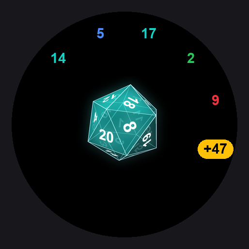
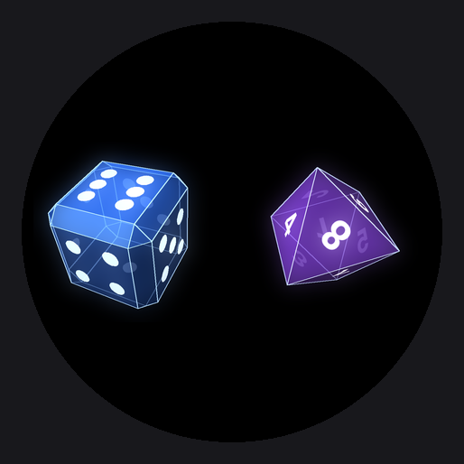
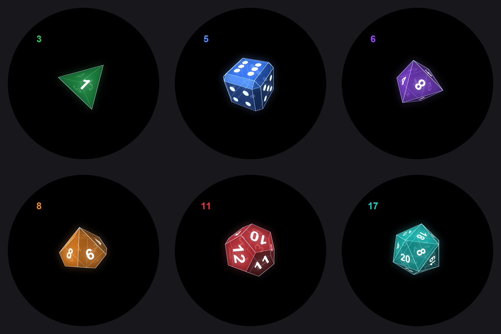
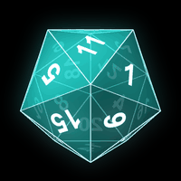

# High Roller

A dice roller for D&D, built as a [Zepp OS](https://docs.zepp.com/) smartwatch app. Spin a translucent gem-style die on your wrist, tap to roll, and keep a running total.

<p align="center">
  
  
</p>

> The images are rendered previews composed from the app's animation frames at the Amazfit GTR 4 resolution (466x466), not simulator captures.

## Dice

D4, D6, D8, D10, D12 and D20, each with its own color.

<p align="center">
  
</p>

<p align="center">
  
</p>

## Controls

| Gesture | Action |
|---|---|
| Tap the die | Roll it (random 1 to N for the shown die) |
| Drag left / right | Slide to the next / previous die. The D4 and D20 bounce back at the ends |
| Drag up / down | The die nudges with your finger and springs back. Dragging up far enough clears the rolls |

Rolls appear around the screen edge in 12 slots, starting upper-left and running clockwise, each in its die's color. With two or more rolls, a gold `+<sum>` pill appears in the next slot. After 11 rolls the ring restarts.

## Development

Requires Node.js and the [Zeus CLI](https://docs.zepp.com/docs/guides/tools/cli/). From `high-roller/`:

```bash
npx zeus dev      # compile and hot-reload on the simulator
npx zeus build    # build a .zab package
npx zeus preview  # QR code to install on a paired watch via the Zepp app
```

Target: Zepp OS API 3.0 (for example Amazfit GTR 4), round and square layouts.

## Animation frames

The dice are rendered as PNG sequences (24 frames, 200x200) rather than drawn at runtime. They are generated with Python (Pillow and numpy):

```bash
python3 scripts/render_d6.py                 # D6 (pips)
python3 scripts/render_dice.py               # D4, D8, D10, D12, D20 (numbered faces)
python3 scripts/render_screenshots.py        # README images
```

Frames are written to `assets/gt.r/anim/<die>/` and `assets/gt.s/anim/<die>/`.

## Project layout

```
high-roller/
  app.json                      manifest
  page/gt/home/index.page.js    state, touch handling, widgets
  page/gt/home/index.page.[r|s].layout.js
                                dice list, ring geometry, widget styles
  assets/gt.[r|s]/anim/         die frame sequences
  scripts/                      frame and image generators
  docs/images/                  README images
```
